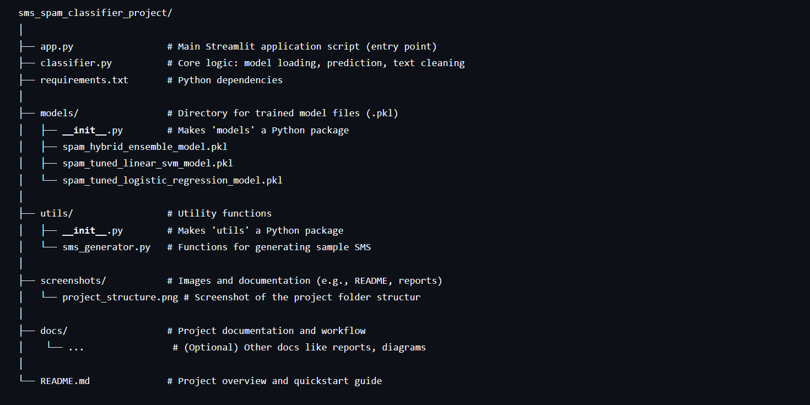

<!-- Project Logo -->

<div align="center">

  <!-- Logo with link -->
 
</div>
<h1 align="center">SMS Spam Detector </h1>

<p align="center">
  <em>Classify SMS Messages as Spam or Ham Instantly with Machine Learning</em>

## 🔧 Built With :

<div align="center">


 <!-- Joblib doesn't have an official logo, using a color -->

</div>

✨ Powered by: `scikit-learn` for robust machine learning models, `Streamlit` for a fast and interactive web UI, `Pandas` for data handling, and `Joblib` for efficient model persistence.

---

## 🌟 Why SMS Spam Detector?

Tired of sifting through suspicious SMS messages?  
**SMS Spam Detector** leverages pre-trained machine learning models to instantly classify SMS text as **Spam** or **Ham (Not Spam)**. Whether you're testing models, analyzing message logs, or just curious, this tool provides:

- 🚀 **Fast Classification** using optimized ML models.
- 🤖 **Multiple Model Options** – Compare results from different algorithms (Ensemble, SVM, Logistic Regression).
- 📝 **Clean Text Preprocessing** – Ensures accurate predictions by mirroring training data preparation.
- 🎲 **Built-in SMS Generator** – Quickly test the classifier with realistic Ham or Spam examples.
- 🧠 **Confidence Scores** – Understand the model's certainty behind each prediction.
- 🖥️ **Simple Web Interface** – Easy-to-use UI built with Streamlit, deployable locally or on servers.

Ideal for:
- Data Scientists 🧪
- Developers 👨‍💻
- Students 📚
- Anyone interested in NLP and ML applications 🤖

---

## 📊 Performance Comparison

We evaluated the core models on a held-out test set to provide a performance benchmark.

| Model                       | Accuracy | Precision (Spam) | Recall (Spam) | F1-Score (Spam) | AUC-ROC |
| :-------------------------- | :------: | :--------------: | :-----------: | :-------------: | :-----: |
| **Hybrid Ensemble Model**   | 0.9848   | 0.9688           | 0.9262        | 0.9470          | 0.9890  |
| Tuned Logistic Regression   | 0.9848   | 0.9583           | 0.9262        | 0.9420          | 0.9872  |
| Tuned Linear SVM            | 0.9848   | 0.9853           | 0.8993        | 0.9404          | 0.9883  |

> **Note:** The Hybrid Ensemble Model combines the strengths of multiple algorithms, resulting in the highest overall performance and robustness for this task.

---

## 📁 Project File Structure

Here's how the project is organized:



---

## 📦 Getting Started

### ✅ Prerequisites

Before you begin, ensure you have:

- [Python 3.9+](https://www.python.org/downloads/) *(required by pip and modern packages)*
- `pip` – Python’s package installer
- `git` – for cloning the repository (optional, you can download the ZIP too)

> 💡 **Note**: The `faker` library is optional. It's used for the SMS generation feature. If not installed, that feature will be disabled.

---

### 🛠️ Installation

1. **Clone the repository (or download the project ZIP)**
   ```bash
   git clone https://github.com/ashishkumar0724/ML_projects.git

2.  **Navigate to the project directory:**
    ```bash
        cd ML_projects/sms_spam_detector
3.  **Install the dependencies:**
        

**Using [pip](https://pypi.org/project/pip/):**

    ❯ pip install -r requirements.txt
 ## ▶️ Run
Run the Streamlit app:

```bash
   streamlit run app.py
```
Maintained by [Ashish Kumar](https://github.com/ashishkumar0724 )

